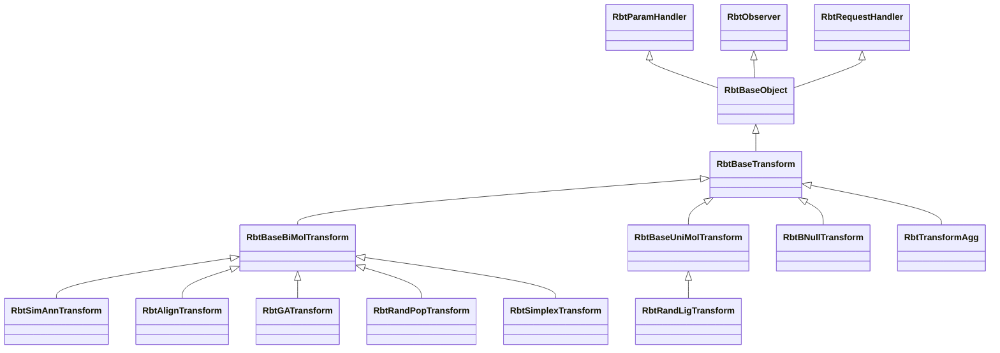

```mermaid
classDiagram
    RbtParamHandler <|-- RbtBaseObject
    RbtObserver <|-- RbtBaseObject
    RbtRequestHandler <|-- RbtBaseObject

    RbtBaseObject <|-- RbtBaseTransform
    RbtBaseTransform <|-- RbtBaseBiMolTransform
    RbtBaseTransform <|-- RbtBaseUniMolTransform
    RbtBaseTransform <|-- RbtBNullTransform
    RbtBaseTransform <|-- RbtTransformAgg

    RbtBaseUniMolTransform <|-- RbtRandLigTransform

    RbtBaseBiMolTransform <|-- RbtSimAnnTransform
    RbtBaseBiMolTransform <|-- RbtAlignTransform
    RbtBaseBiMolTransform <|-- RbtGATransform
    RbtBaseBiMolTransform <|-- RbtRandPopTransform
    RbtBaseBiMolTransform <|-- RbtSimplexTransform 

```